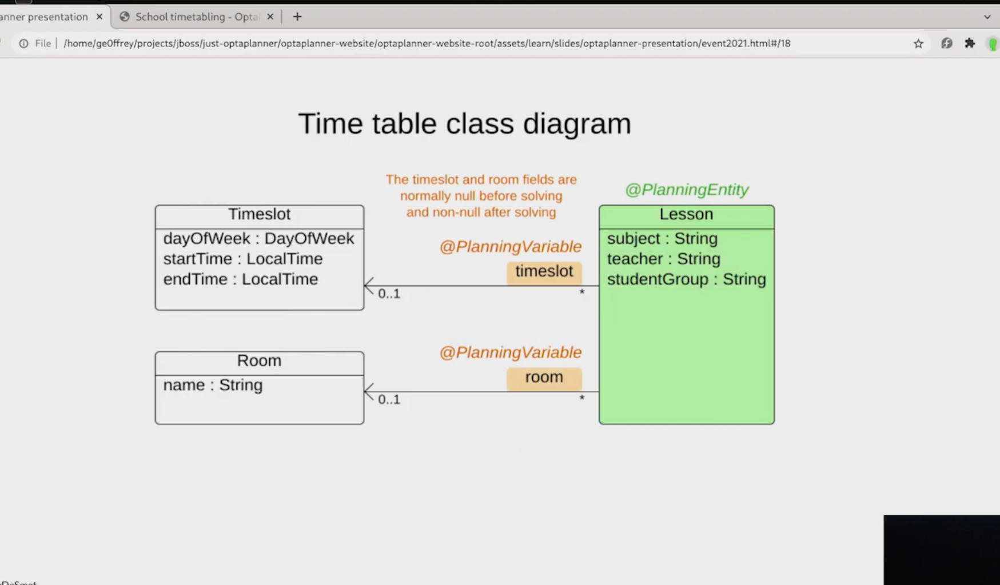

= AI Constraints Programming with Quarkus and OptaPlanner
2022-11-03
:jbake-type: post
:jbake-tags: quarkus, constraints, optaplanner, java
:jbake-status: published

== AI on Quarkus: I love it when an OptaPlan comes together

I have been meaning to look at https://www.optaplanner.org/[OptaPlanner] for ages. All i can say is _"Sorry Geoffrey De Smet, you are a goddamn genius and i should have played with OptaPlanner way sooner"._

So, i watched this video to see how to get started.

video::3N3NoDs3Ylc[youtube]

So much fun ! 😁 to code.

[[school-timetable]]
.Quarkus School Timetable
image::/2022/11/quarkus-school-timetabling-screenshot.png["Quarkus School Timetable"]

There were a couple of long learnt lessons i remembered whilst playing with the code.

(1) Domain Driven Design

To get at the heart of constraints programming you need a good object class hierarchy, one that is driven by your business domain. Thanks Eric Evans for the gift that keep giving - DDD is perfect to help you out here.

[[school-timetable-class]]
.Class Diagram

You need to have a clean and well thought out class heirarchy so that wiring in OptaPlanner will work for you. I can see several iterations and workshop sessions ensuing to get to a workable and correct understanding of the problem domain.

(2) Constraints Programming

I went looking for some code i helped write some 15 years ago ! A https://en.wikipedia.org/wiki/Constraint_programming[Constraint] based programming model we had written in C++

++++

++++

We had a whole bunch of Production classes used for calculating different trades types and their values. You added these _productions_ into a solver class heirarcy and if you had the right https://en.wikipedia.org/wiki/Degrees_of_freedom[degrees of freedom] your trade calculation would be successful. The beauty of it was the solver would spit out any parameter you had not specified, as long as it was possible to calculate it based on the production rules.

OptaPlanner viscerally reminded me of that code and experience, and started me thinking about how to use it for a similar use case.

++++

++++

I am now a fan 🥰

One last lesson from the OptaPlanner crew was their change to use a new static doc generation system, which is a thing of beauty i have to say, to https://jbake.org[JBake] which i am using to write this blog with. Thanks for all the fish 🐟 🐠 Geoff.

OptaPlanner Quickstarts Code - https://github.com/kiegroup/optaplanner-quickstarts
